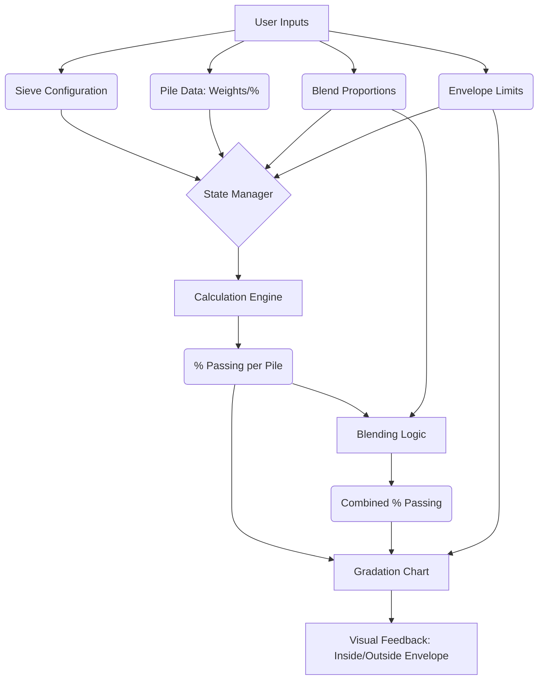

# Sieve Analysis and Aggregate Blending Simulator - Technical Plan

## 1. Project Setup
- Initialize Next.js app with App Router, TypeScript, and Tailwind CSS.
- Install dependencies: `framer-motion`, `recharts` (or `d3`), `lucide-react` (for icons), `clsx`, `tailwind-merge` (for utility classes).

## 2. Architecture & State Management
- **State**: Use React Context with `useReducer` to manage the complex, interconnected state (sieves, piles data, blend proportions, selected envelopes).
- **Persistence**: Implement a custom hook to sync the main state with `localStorage`.

## 3. Core Domain Utilities (`src/utils`)
- `calculations.ts`: Functions for computing % retained, cumulative %, % passing, and blending logic.
- `unitConversion.ts`: Normalize everything to grams and mm.
- `constants.ts`: Pre-defined standard sieves (IS 2720) and MoRTH envelopes (GSB I, II, III, WMM).

## 4. UI Components (`src/components`)
- **Layout**: Main dashboard layout with header, dark/light mode toggle.
- **SieveSelector**: Let users pick standard or custom sieves.
- **PileInputTable**: Data grid for entering weights/percentages per pile.
- **BlendController**: Sliders for interactive proportion adjustments.
- **GradationChart**: The core visualization. Needs a logarithmic X-axis for sieve sizes and a linear Y-axis for % passing. Will show individual pile curves, the combined blended curve, and the shaded envelope limits.
- **EnvelopeOverlay**: Controls to select standard MoRTH specifications or input custom limit bands.

## 5. Implementation Phases
1. Scaffold project and install dependencies.
2. Build domain logic functions and unit converters.
3. Build the core state context and localStorage sync.
4. Implement Step 1 (Sieve Selection) & Step 2 (Pile Inputs).
5. Implement Step 3 & 4 (Data Computation and Base Chart).
6. Implement Step 5 (Interactive Blending).
7. Implement Step 6 & 7 (Envelope Selection and Chart Highlighting).
8. Polish UI, add animations, and handle edge cases (validation).

## System Data Flow Diagram

